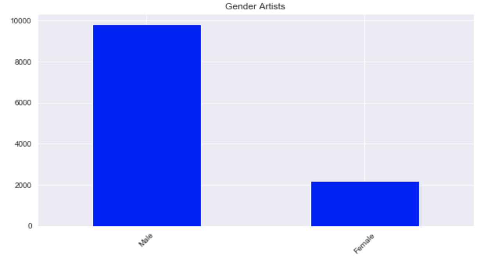
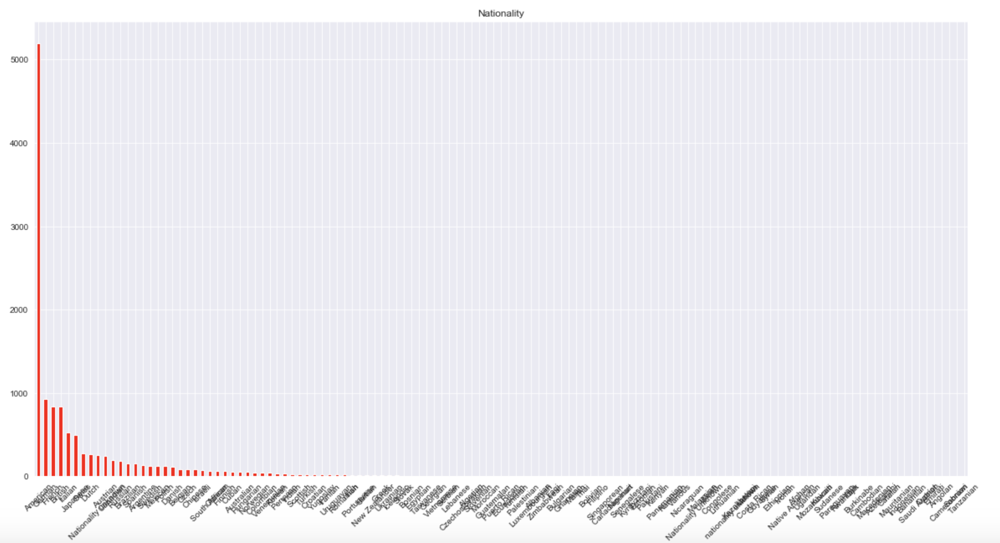
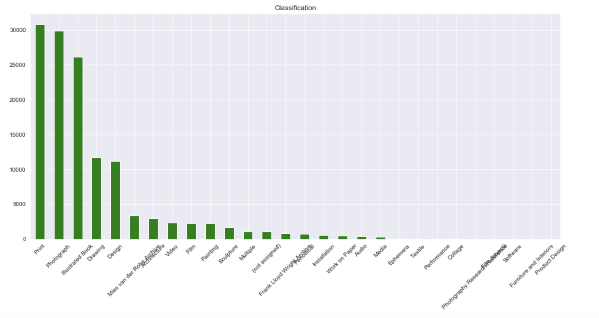
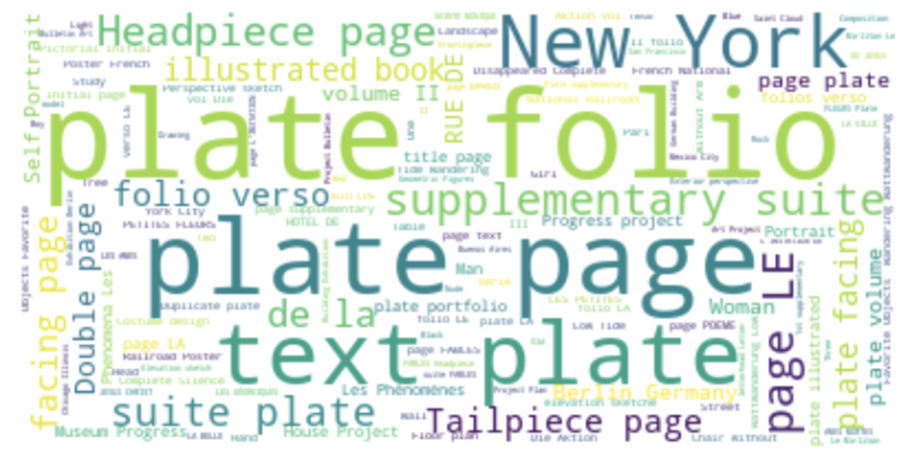
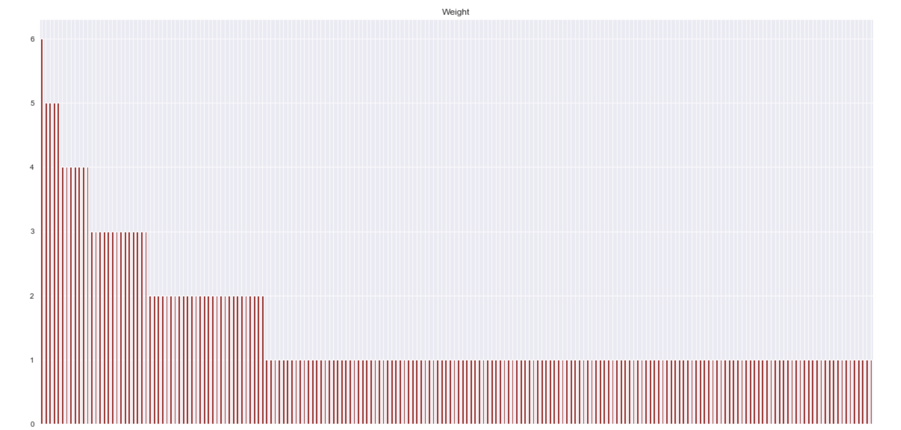
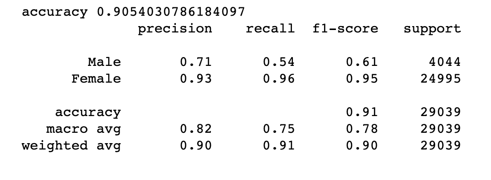

# MoMA
Analyzing MoMA artworks collection

The goal of this project was to explore and analyze the MoMA artwork collection using [data found on Kaggle](https://www.kaggle.com/momanyc/museum-collection#artworks.csv). It contained two datasets, one with information about artists and another with information about artworks. I performed exploratory data analysis and coded up some visualizations to illustrate statistical distributions of several variables. Also I have decided that it would be intersting to try to classify artworks by gender of the artists using just the titles of the pieces. Logistic regression model gave some impressive results!

